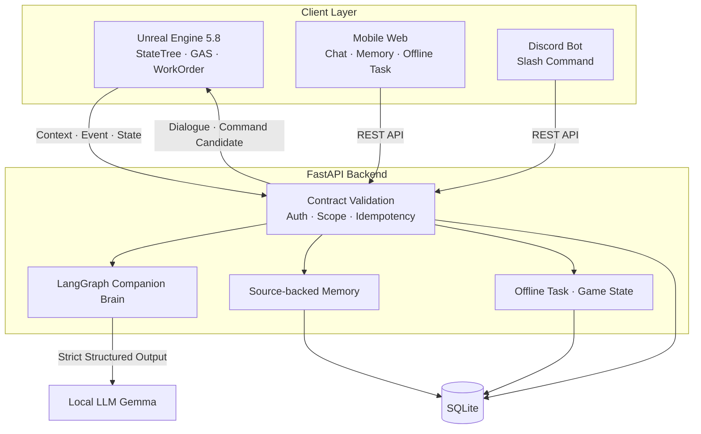
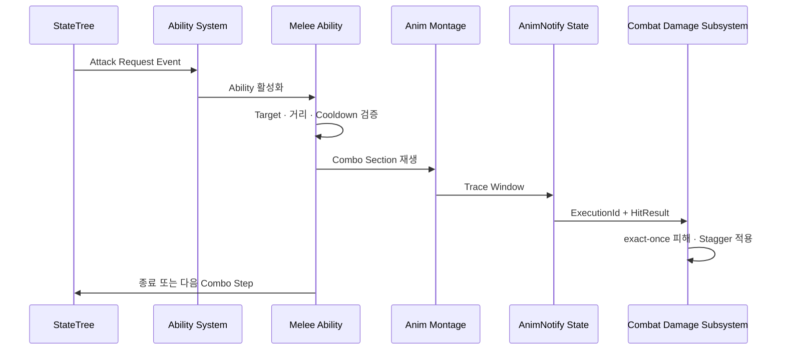
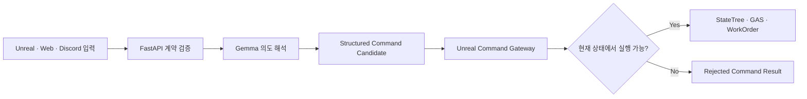

<div align="center">


# AI:RE

**게임 안에서는 스스로 판단하고, 게임 밖에서는 사용자를 기억하는 AI 동료 프로젝트**


[Backend](https://github.com/AIREProject/AIRE_SERVER) · [Discord Bot](https://github.com/AIREProject/AIRE_Discord) · [Mobile Web](./WebApp/README.md)

</div>

## 프로젝트 소개

AI:RE는 Unreal Engine 5의 AI Companion **MAKO**와 FastAPI Backend, Local LLM Gemma, Mobile Web, Discord를 하나의 사용자·세이브·동료 범위로 연결한 AX 프로젝트입니다.

MAKO는 게임 안에서 StateTree와 GAS를 기반으로 플레이어를 따라다니며 전투·회피·지원·제작·채집을 수행합니다. 게임 밖에서는 Mobile Web과 Discord에서 같은 MAKO와 대화하고, 함께한 사건과 사용자가 직접 공유한 사실을 장기기억으로 이어갑니다.

| 항목 | 내용 |
| --- | --- |
| 개발 기간 | 2026.07.13 ~ 2026.08.28 |
| 개발 인원 | 2인 협업 |
| 담당 | MAKO 로컬 행동·전투·작업, Unreal↔Backend 연동, Backend·DB·LLM, Web·Discord 통합 |
| 개발 환경 | Unreal Engine 5.8, C++, Python 3.13, TypeScript |
| 플랫폼 | Windows PC, Mobile Web, Discord |
| AI / Data | Gemma, LangGraph, FastAPI, SQLAlchemy Async, SQLite |

### 주요 구현 범위

| 영역 | 구현 내용 |
| --- | --- |
| Companion AI | StateTree 행동 중재, AI Perception Threat, Follow·Return·Combat·Support·Work |
| 전투 | GAS Attribute·Ability·Effect, 4단 콤보, 전투 스킬, 자율 회피, 회복 지원 |
| Animation | Weapon Definition, Linked Anim Layer, Montage, AnimNotify State, Socket Trace |
| 생활 시스템 | WorkOrder 제작·채집, Inventory·Equipment·Shared Storage, SaveGame |
| AI 연동 | GameContext, Command Gateway, 구조화 명령 후보, Backend 장애 시 Local AI 유지 |
| Cross-device | 장기기억, Offline Task, Game State, Durable Outbox, Mobile Web, Discord |

## 전체 구조



Unreal은 현재 게임 상태와 최종 실행 권한을 소유합니다. Backend와 Gemma는 대사·기억·행동 후보를 제공하지만, 실제 이동·공격·제작은 Unreal의 Command Gateway가 다시 검증한 뒤 기존 StateTree·GAS·WorkOrder로 전달합니다.

## 1. StateTree와 GAS를 분리한 Companion AI

로컬 행동 판단과 전투 규칙을 한 클래스에 모으지 않고, 변경 이유와 수명주기에 따라 책임을 나눴습니다.

| 구성 | 책임 |
| --- | --- |
| `AAIRECompanionCharacter` | MAKO의 물리 표현, ASC·AttributeSet과 기능 Component 조립 |
| `AAIRECompanionAIController` | Possession, StateTree 실행, AI 이동 조율 |
| StateTree | Survival → Combat·Support → Command → Work → Follow·Idle 우선순위 중재 |
| Threat Component | AI Perception 감지, 유효 Target 선택과 소실 정리 |
| GAS | Health·Stamina, 비용·Cooldown, 공격·회피·지원 Ability와 Effect |

```text
AI Perception
  -> Threat Component가 Target 선택
  -> StateTree가 현재 우선 행동 결정
  -> Gameplay Event로 행동 요청
  -> GAS Ability가 Target·거리·상태·Cooldown 재검증
  -> Effect 적용과 Gameplay Tag 갱신
  -> StateTree가 다음 행동으로 복귀
```

- 선택 Target에 추가 소실 거리와 시야 기억 시간을 적용해 짧은 차폐에서 Target이 반복 교체되지 않도록 했습니다.
- `HoldFire`, `DefendPlayer`, `Aggressive` 교전 정책과 `Balanced`, `SupportPriority` 역할 선호를 별도 정책 Component에서 관리합니다.
- Backend 또는 LLM이 중단되어도 Idle·Follow·Return·Combat은 Unreal 로컬에서 계속 판단합니다.
- StateTree는 Health나 Stamina를 직접 바꾸지 않고 행동 의도만 전달합니다.

관련 코드: [AIRECompanionCharacter.cpp](UEProject/Source/AI_RE/LMK/MAKO/Private/Core/AIRECompanionCharacter.cpp), [AIRECompanionAIController.cpp](UEProject/Source/AI_RE/LMK/MAKO/Private/Core/AIRECompanionAIController.cpp), [AIRECompanionStateTree.cpp](UEProject/Source/AI_RE/LMK/MAKO/Private/LocalAI/StateTree/AIRECompanionStateTree.cpp), [AIRECompanionThreatComponent.cpp](UEProject/Source/AI_RE/LMK/MAKO/Components/Private/Threat/AIRECompanionThreatComponent.cpp)

## 2. GAS 전투와 데이터 기반 무기

무기마다 별도 전투 클래스를 만들지 않고 `UAIRECompanionWeaponDefinitionDataAsset`이 AbilitySet, 콤보, Montage, Linked Anim Layer와 Trace 정보를 함께 소유하도록 구성했습니다.



### 콤보와 전투 스킬

- `Attack_01 ~ Attack_04` Section을 하나의 Melee Ability가 순차 실행합니다.
- Combo Window는 초 단위 Timer가 아니라 AnimNotify State가 여닫습니다.
- 독립 Combat Skill Ability가 콤보 사이에 개입한 뒤 보존한 Step부터 기본 공격을 재개합니다.
- 공격·스킬·회피의 Request, Hit, Cooldown Tag와 수명주기를 각각 분리했습니다.

### Layered ABP와 근접 Trace

- 기본 Locomotion ABP를 유지하면서 무기별 상체 표현만 Linked Anim Layer로 교체합니다.
- 좌·우 칼날 Base/Tip Socket 사이를 Capsule Sweep하고 프레임 사이를 Substep으로 보간합니다.
- AnimNotify는 판정 시점만 알리고, 실제 명중과 피해는 Ability와 공용 Damage Subsystem이 확정합니다.
- `ExecutionId + Target` 조합으로 같은 공격의 중복 피해를 막습니다.
- Unequip·사망·Target 소실·늦은 비동기 Callback에서 Ability, Timer, Delegate와 Anim Layer를 정리합니다.

관련 코드: [AIRECompanionMeleeAttackAbility.cpp](UEProject/Source/AI_RE/LMK/MAKO/Private/AbilitySystem/Combat/Abilities/AIRECompanionMeleeAttackAbility.cpp), [AIRECompanionCombatSkillAbility.cpp](UEProject/Source/AI_RE/LMK/MAKO/Private/AbilitySystem/Combat/Abilities/AIRECompanionCombatSkillAbility.cpp), [AIRECompanionWeaponDefinitionDataAsset.cpp](UEProject/Source/AI_RE/LMK/MAKO/Private/Equipment/AIRECompanionWeaponDefinitionDataAsset.cpp), [AIRECompanionMeleeTraceAnimNotifyState.cpp](UEProject/Source/AI_RE/LMK/MAKO/Private/Animation/AIRECompanionMeleeTraceAnimNotifyState.cpp), [AIRECombatDamageSubsystem.cpp](UEProject/Source/AI_RE/Global/Combat/Private/AIRECombatDamageSubsystem.cpp)

## 3. 자율 회피와 지원 행동

MAKO는 적이 자신을 대상으로 시작한 공격 Snapshot을 읽고, 같은 공격에 대해 한 번만 회피 여부를 결정합니다.

```text
적 공격 Snapshot
  -> ExecutionId 기반 Deterministic Roll
  -> 반응 지연
  -> Stamina · Cooldown · 공격 유효성 재검증
  -> 좌우 Capsule Sweep으로 이동 가능 거리 비교
  -> 실제 Capsule 이동
  -> 성공한 이동에만 Cost와 Cooldown Commit
```

실제 이동은 `UAIRECombatEvadeComponent`, 표현은 in-place Montage가 담당합니다. 지원 행동은 MAKO 자신의 Inventory에서 회복 아이템을 선택해 유효한 아군에게 사용하며, 접근 중 Combat이 선점되거나 Target이 사라지면 아이템 소비와 Cooldown을 남기지 않습니다.

관련 코드: [AIRECompanionAutonomousEvadeAbility.cpp](UEProject/Source/AI_RE/LMK/MAKO/Private/AbilitySystem/Combat/Abilities/AIRECompanionAutonomousEvadeAbility.cpp), [AIRECombatEvadeComponent.cpp](UEProject/Source/AI_RE/Global/Components/Private/AIRECombatEvadeComponent.cpp), [AIRECompanionUseHealingItemAbility.cpp](UEProject/Source/AI_RE/LMK/MAKO/Private/AbilitySystem/Support/Abilities/AIRECompanionUseHealingItemAbility.cpp)

## 4. WorkOrder, Inventory와 SaveGame

제작·채집·보관함 이동을 독립된 임시 로직으로 처리하지 않고 공통 WorkOrder와 Gameplay Inventory 경계로 연결했습니다.

| 시스템 | 설계 포인트 |
| --- | --- |
| WorkOrder | ID·Type·Target·State·Failure를 Typed Data로 관리하고 전투 개입 후 재개 |
| Inventory | Player·MAKO·Shared Storage의 Post-state를 먼저 계산하고 전량 처리 시에만 Commit |
| Equipment | 비동기 자산과 Ability·Animation 장착이 완료된 뒤 Equipment Slot 확정 |
| Crafting | 양쪽 Inventory를 하나의 재료 Pool로 계산하고 재료 제거와 결과 배치를 원자 처리 |
| Harvest | Delivery ID로 중복 보상을 막고 MAKO → Shared Storage → World Drop 순서로 귀결 |
| SaveGame | Primary·Previous 두 세대와 Generation 검증으로 최신 유효 상태 복원 |

Mutation ID, Container Revision과 Session ID를 검증하며 성공한 요청의 재전송에는 `AlreadyApplied`를 반환합니다. UI는 Snapshot만 표시하고 실제 Item 배열과 Revision은 Gameplay Subsystem이 소유합니다.

관련 코드: [AIREGameplayInventorySubsystem.cpp](UEProject/Source/AI_RE/Global/Components/Private/AIREGameplayInventorySubsystem.cpp), [AIRECompanionWorkOrderComponent.cpp](UEProject/Source/AI_RE/LMK/MAKO/Components/Private/Work/AIRECompanionWorkOrderComponent.cpp), [AIRECompanionEquipmentComponent.cpp](UEProject/Source/AI_RE/LMK/MAKO/Components/Private/Equipment/AIRECompanionEquipmentComponent.cpp), [AIREGameplayInventorySaveGame.cpp](UEProject/Source/AI_RE/Global/Inventory/Private/AIREGameplayInventorySaveGame.cpp)

## 5. Command Gateway와 GameContext

LLM 출력은 신뢰할 수 있는 게임 명령이 아니라 **행동 후보**로 취급합니다.



Unreal은 위치·위협·주변 자원·작업대·현재 Work·Inventory를 `GameContextV1`으로 제한해 전달합니다. Command Gateway는 Candidate의 Type, Target, 거리, 도달 가능성, 만료, 중복, Inventory Revision을 다시 검사합니다.

- 자유 텍스트를 함수명·UObject 경로·Console Command로 직접 변환하지 않습니다.
- `CraftItem`은 안정 Recipe ID를 DataTable Row와 Workbench에 매핑한 뒤 기존 Crafting WorkOrder로 전달합니다.
- `GatherResource`는 제한 반경에서 실제 자원을 다시 검색해 기존 Harvesting WorkOrder로 전달합니다.
- 실패·Timeout·Malformed 응답은 Local AI와 Gameplay 상태를 변경하지 않습니다.

관련 코드: [AIREWorldContextBuilder.cpp](UEProject/Source/AI_RE/LMK/MAKO/Private/Chat/Context/AIREWorldContextBuilder.cpp), [AIRECompanionCommandGatewayComponent.cpp](UEProject/Source/AI_RE/LMK/MAKO/Components/Private/Command/AIRECompanionCommandGatewayComponent.cpp), [AIRECompanionChatComponent.cpp](UEProject/Source/AI_RE/LMK/MAKO/Components/Private/Chat/AIRECompanionChatComponent.cpp)

## 6. Offline Task와 데이터 동기화

Mobile Web과 Discord에서 생성한 채집·제작 작업은 서버 시간으로 진행되고, UE 실행 시 Inventory에 반영됩니다.

```text
Web / Discord 작업 생성
  -> Backend가 정책과 재료 예약을 Transaction으로 저장
  -> 서버 시간 기준 진행량 계산
  -> UE가 완료 가능한 결과 조회
  -> Local Inventory 원자 적용
  -> SaveGame 성공
  -> Backend Claim
  -> 최신 Game State 업로드
```

Task ID Ledger로 재접속·재전송 시 중복 지급을 막고, Operation ID와 Body Hash로 Game State·Event 전송의 재시도와 충돌을 구분합니다. `UAIRESyncOutboxSubsystem`은 전송을 At-least-once로 수행하되 서버 반영은 Idempotent하도록 구성되어 있습니다.

관련 코드: [AIREOfflineTaskSubsystem.cpp](UEProject/Source/AI_RE/LMK/MAKO/Private/Offline/AIREOfflineTaskSubsystem.cpp), [AIRESyncOutboxSubsystem.cpp](UEProject/Source/AI_RE/Global/Sync/Private/AIRESyncOutboxSubsystem.cpp)

## Mobile Web

WebClient는 별도 저장소로 분리할 수 있도록 `WebApp/` 안에 실행 설정, API Client, UI와 배포 파일을 함께 두었습니다. Chat, 장기기억 관리와 Offline Task를 제공하지만 UE Gameplay 상태를 직접 변경하지 않습니다.

구조와 실행 방법은 [WebApp README](WebApp/README.md)에서 별도로 설명합니다.

## 협업 방식

2인 협업에서 Companion과 Player 영역을 분리하고, 서로 만나는 지점은 공용 Interface와 데이터 계약으로 고정했습니다.

| 기준 | 적용 내용 |
| --- | --- |
| Gameplay 경계 | Combat Damage, Inventory, Workbench를 공용 Interface로 연결 |
| 저장소 경계 | Unreal·Web은 `AI_RE`, Backend·DB·LLM은 `AIRE_SERVER`, Discord는 별도 저장소로 분리 |
| 계약 공유 | OpenAPI, Pydantic DTO, Unreal USTRUCT, TypeScript Runtime Validator를 함께 갱신 |
| Git 협업 | GitHub Issue, 기능 브랜치, Pull Request와 Notion 문서를 기준으로 통합 |

## 실행 방법

### Unreal Engine

1. Unreal Engine 5.8을 설치합니다.
2. 저장소를 Clone합니다.
3. `UEProject/AI_RE.uproject`를 Unreal Editor에서 엽니다.
4. Backend 연동이 필요한 경우 [AIRE Server](https://github.com/AIREProject/AIRE_SERVER)를 먼저 실행하거나 배포 서버 설정을 사용합니다.

Unreal 프로젝트의 컴파일·Editor·PIE 검증은 로컬 Unreal 개발 환경에서 수행해야 합니다.

### Web

```powershell
Set-Location WebApp
npm.cmd install
npm.cmd run dev
```

자세한 환경변수와 배포 방식은 [WebApp README](WebApp/README.md)를 확인하세요.

## 디렉터리 구조

```text
AI_RE/
├─ UEProject/
│  ├─ Source/AI_RE/
│  │  ├─ LMK/MAKO/              # Companion, StateTree, GAS, Work, Chat
│  │  ├─ Global/                # Damage, Inventory, Save, Sync, World Time
│  │  └─ OBI/                   # Player 기능 영역
│  ├─ Content/                  # Blueprint, Data Asset, Animation, Map
│  └─ AI_RE.uproject
├─ WebApp/                      # 독립 가능한 Mobile WebClient
├─ Docs/                        # 팀 공유 아키텍처와 연동 계약
├─ Contracts/                   # Legacy 계약 참고 자료
├─ Images/                      # README와 포트폴리오 이미지
└─ README.md
```

## 사용 기술

- **Game Client**: Unreal Engine 5.8, C++, Blueprint, StateTree, GAS, AI Perception, UMG
- **Animation**: Animation Blueprint, Linked Anim Layer, Montage, AnimNotify State
- **Networking**: Unreal HTTP, WebSocket, Typed JSON Adapter, Command Gateway
- **Persistence**: SaveGame, Generation Fallback, Mutation Ledger, Durable Outbox
- **Web**: TypeScript, Vite, HTML, CSS, GPT Sites Worker
- **Collaboration**: Git, GitHub, OpenAPI, Notion

## 관련 문서와 저장소

- [AIRE Server](https://github.com/AIREProject/AIRE_SERVER)
- [AIRE Discord Bot](https://github.com/AIREProject/AIRE_Discord)
- [Companion GAS Combat](Docs/UE/COMPANION_GAS_COMBAT.md)
- [Gameplay Inventory](Docs/UE/GAMEPLAY_INVENTORY.md)
- [Backend Integration](Docs/Backend/EXTERNAL_SERVER_INTEGRATION.md)

> 교육과정 종료에 따라 공개 Backend와 Local LLM 서버는 2026년 9월부터 운영이 종료될 예정입니다. Unreal의 Local Companion Gameplay와 Mock Provider 기반 Backend는 별도로 실행할 수 있습니다.
