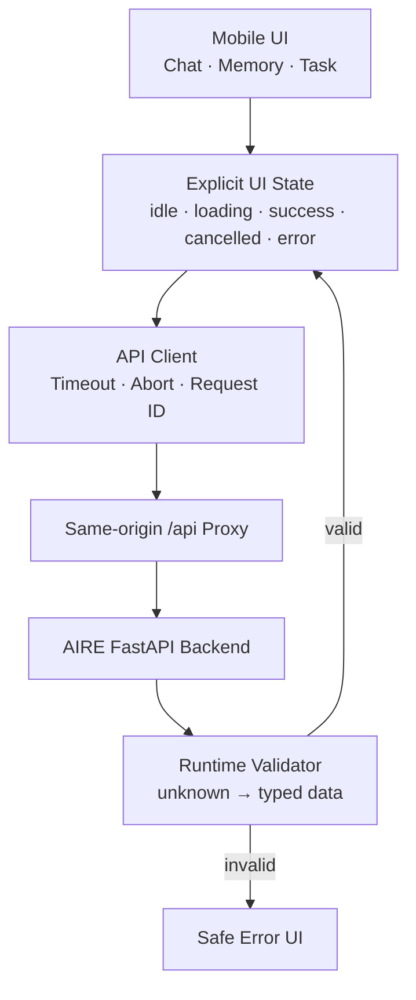
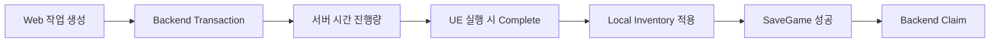

<div align="center">

# AI:RE Mobile Web

**게임 밖에서도 MAKO와 대화하고 기억과 오프라인 작업을 관리하는 Mobile WebClient**


[Web Demo](https://aire-mako-chat.lunau1f320.chatgpt.site) · [전체 프로젝트](https://github.com/AIREProject/AI_RE) · [Backend](https://github.com/AIREProject/AIRE_SERVER)

</div>

## 프로젝트 소개

AI:RE Mobile Web은 Unreal을 실행하지 않은 상태에서도 같은 MAKO와 관계를 이어가기 위한 반응형 WebClient입니다. Chat, 장기기억 관리, Offline Task를 제공하며 `AIRE_OPEN / demo-slot-1 / mako` Scope를 Unreal·Discord와 공유합니다.

Framework 없이 Vite와 strict TypeScript로 구현했으며, 외부 API 응답은 모두 `unknown`에서 시작해 Runtime Validator를 통과한 값만 UI 상태에 반영합니다.

| 영역 | 제공 기능 |
| --- | --- |
| Chat | RealWorld 대화, 요청 취소, MAKO 응답과 Offline Task 연결 |
| Memory | 목록·검색·상세·정정·고정·삭제·전체 초기화 |
| Memory Review | 후보 상세, Type·Importance 수정, Approve·Reject |
| Offline Task | 채집·제작 생성, 상태 필터, 진행량 조회, 활성 예약 취소 |
| Hosting | Vite 개발 Proxy, GPT Sites 정적 배포와 Same-origin API Worker |

## 전체 구조



## 1. 외부 응답 Runtime Validation

TypeScript Type은 Runtime 응답을 보장하지 않으므로 API Boundary에서 JSON Shape를 직접 검사합니다.

- HTTP Status와 Content-Type을 확인한 뒤 JSON을 파싱합니다.
- 응답 Body의 `request_id`와 Header `X-Request-ID` 상관관계를 검증합니다.
- Chat, Memory, Candidate와 Offline Task DTO를 기능별 Validator로 분리합니다.
- Malformed Data는 일부 필드만 추측해 표시하지 않고 전체 요청을 실패 처리합니다.
- Token, Provider, 내부 Source ID와 Error Detail 같은 운영 정보는 UI와 Console에 노출하지 않습니다.

관련 코드: [client.ts](src/api/client.ts), [memories.ts](src/api/memories.ts), [offlineTasks.ts](src/api/offlineTasks.ts)

## 2. 명시적인 비동기 상태와 취소

요청 상태를 `idle`, `sending/loading`, `success`, `cancelled`, `error`로 나눠 중복 제출과 늦은 응답이 UI를 덮어쓰는 문제를 막았습니다.

```text
사용자 제출
  -> 새 Request ID · AbortController 생성
  -> 입력 잠금과 Loading 표시
  -> 성공: 검증된 응답만 UI 반영
  -> 취소: 사용자 Message는 유지, MAKO 응답은 추가하지 않음
  -> 실패: 자동 재전송 없이 안전한 오류 표시
  -> 완료: 현재 요청과 일치할 때만 입력 복구
```

Browser 취소는 대기만 중단할 뿐 Backend 처리의 Rollback을 의미하지 않습니다. Timeout·취소 뒤 같은 Body를 자동 재전송하지 않고, 사용자가 목록 새로고침으로 서버 상태를 먼저 확인하도록 구성했습니다.

## 3. 출처가 보이는 장기기억 관리

Memory Card에는 사용자에게 필요한 정보만 표시합니다.

| 표시 | 숨김 |
| --- | --- |
| 기억 Type, 현재 Text, 생성 시각, 정정 여부 | Provider, Confidence, 내부 Source ID |
| 안전한 출처 설명, 고정 상태, 사용 횟수 | Numeric Importance, Archived 원문 |
| 마지막 사용 시각 | 인증 정보와 Error Detail |

정정에는 수정문과 사유를 함께 보내고, 삭제·전체 초기화에는 확인 단계를 둡니다. 후보 검토는 별도 Feature Flag로 제어하며, 배포 Backend 계약이 준비된 경우에만 화면을 활성화합니다.

## 4. 서버 권위 Offline Task

Web은 작업을 요청하고 진행 상태를 보여주지만 Gameplay 결과를 직접 Inventory에 지급하지 않습니다.



- Gathering은 `PlantStem`, Crafting은 `ShoddyBandage` 수직 흐름을 제공합니다.
- Crafting 생성 시 최신 Game State를 기준으로 Backend가 재료를 예약합니다.
- 진행량은 Browser Timer로 예측하지 않고 명시적 목록 갱신에서 서버 값을 표시합니다.
- Pending·InProgress 예약만 취소할 수 있으며, 제작 예약 취소 시 Backend가 재료를 환불합니다.
- WebClient는 GameClient 전용 Start·Complete·Claim Endpoint를 호출하지 않습니다.

## 5. Same-origin 개발·배포 경계

Local Vite와 배포 Worker 모두 Browser에서는 `/health`, `/api/*` Same-origin 경계를 사용합니다.

```text
Local Development
Browser /api/* -> Vite Proxy -> AIRE Backend

GPT Sites
Browser /api/* -> Worker Proxy -> AIRE Backend
Browser /*      -> Static Assets -> SPA Fallback
```

`VITE_API_BASE_URL`을 지정한 경우에만 Browser가 명시적 API Origin을 직접 호출합니다. 기본 경로는 CORS와 배포 환경 차이를 줄이기 위해 Same-origin Proxy를 사용합니다.

## 빠른 시작

```powershell
git clone https://github.com/AIREProject/AI_RE.git
Set-Location AI_RE\WebApp
npm.cmd install
npm.cmd run dev
```

기본 개발 Proxy는 배포 Backend를 사용합니다. Local Backend로 전환하려면 다음과 같이 실행합니다.

```powershell
$env:VITE_DEV_API_PROXY_TARGET = "http://127.0.0.1:8010"
npm.cmd run dev
```

## 환경변수

| 변수 | 기본 동작 | 용도 |
| --- | --- | --- |
| `VITE_API_BASE_URL` | 빈 값 | Browser가 호출할 명시적 API Origin. 비우면 Same-origin 사용 |
| `VITE_DEV_API_PROXY_TARGET` | 배포 Backend | Vite 개발 Proxy Target |
| `VITE_MEMORY_ENABLED` | `true` | Memory Tab 활성화 |
| `VITE_MEMORY_REVIEW_ENABLED` | `false` | Memory Candidate Review 활성화 |

Bearer, Save Slot과 Companion ID는 현재 Demo 제품 Scope에 맞춰 `AIRE_WEB / demo-slot-1 / mako`로 고정되어 있습니다.

## 검증과 빌드

```powershell
npm.cmd run typecheck
npm.cmd run build
npm.cmd run preview
```

`build`는 strict TypeScript 검사와 Vite Build를 실행하고, GPT Sites용 Worker와 Hosting 산출물을 `dist/`에 준비합니다.

## 독립 저장소로 분리

`WebApp/`은 상위 Unreal Source를 Import하지 않으며 다음 파일을 함께 이동하면 독립 저장소로 사용할 수 있습니다.

```text
WebApp/
├─ .openai/hosting.json
├─ scripts/prepare-sites-dist.mjs
├─ sites/worker.js
├─ src/
├─ index.html
├─ package.json
├─ package-lock.json
├─ tsconfig.json
├─ vite.config.ts
└─ README.md
```

분리 후에는 README의 Clone 경로와 GitHub 링크만 새 저장소 주소로 변경하면 됩니다. Backend 계약은 AIRE Server의 OpenAPI를 계속 기준으로 사용합니다.

## 디렉터리 구조

```text
src/
├─ api/
│  ├─ client.ts          # 공용 HTTP, Timeout, Error Normalization
│  ├─ memories.ts        # Memory · Candidate 계약과 Validator
│  └─ offlineTasks.ts    # Offline Task 계약과 Validator
├─ config.ts             # Client Scope와 Feature Flag
├─ main.ts               # 화면 상태와 Event 연결
└─ style.css             # Mobile-first Layout
```

## 사용 기술

- **TypeScript 5.8 strict**: 외부 응답 Validation과 명시적인 UI 상태
- **Vite 7**: 개발 Server, Proxy와 Static Build
- **HTML / CSS**: Framework 없는 Mobile-first UI
- **AbortController**: Chat·Memory·Task 요청 취소
- **GPT Sites Worker**: Static Asset과 Same-origin Backend Proxy

> 공개 AIRE Backend와 Gemma 서버는 교육과정 종료에 따라 2026년 9월부터 운영이 종료될 예정입니다. 이후에는 `VITE_DEV_API_PROXY_TARGET`, `VITE_API_BASE_URL` 또는 배포 Worker의 Backend Origin을 별도 AIRE Server 주소로 변경해야 합니다.
